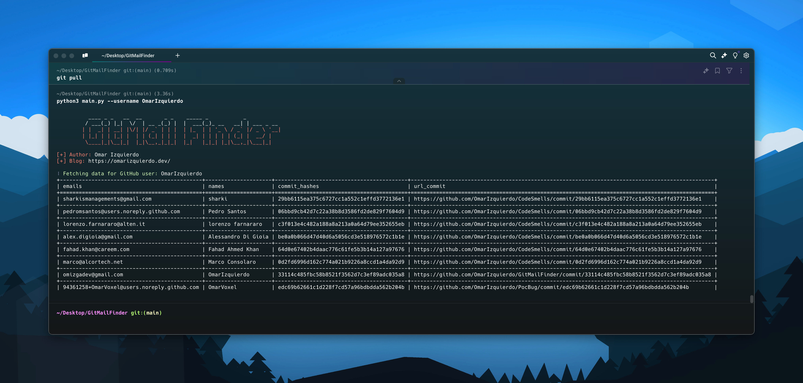

# GitMailFinder

GitMailFinder is a powerful tool designed to help you **find email addresses** embedded within the commit history of a specified GitHub user's repositories. Whether you're a developer looking to reach out to collaborators or just curious about the contributions made by others, GitMailFinder makes it easy to extract email addresses from public repositories.



## Features
- 📧 Extract email addresses from commits
- 🔍 Search across all repositories of a given GitHub user
- 🛠️ Simple command-line interface
- 📄 Clear and user-friendly output

## Usage

To use GitMailFinder, run the following command in your terminal:

```bash
python3 main.py -u [--username] <GITHUB_USERNAME>
```

Replace `<GITHUB_USERNAME>` with the GitHub username you wish to search for. For example:

```bash
python3 main.py -u OmarIzquierdo
```


## Command-Line Options

When you run the command with the --help flag, you’ll see the following usage instructions:
```bash
python3 main.py --help 
usage: main.py [-h] -u USERNAME

Find Github Emails

optional arguments:
  -h, --help            show this help message and exit
  -u USERNAME, --username USERNAME
                        GitHub username
```

## Installation

##### 1. Clone the repository:

```bash
git clone https://github.com/yourusername/EmailGithubFinder.git
cd EmailGithubFinder
```
##### 2. Create a virtual environment (optional but recommended):

```bash
python3 -m venv .venv
source .venv/bin/activate  # On Windows use `.venv\Scripts\activate`
```

##### 3. Install the required packages:

```bash
pip install -r requirements.txt
```

## Contributing

Contributions are welcome! If you have suggestions or find bugs, feel free to open an issue or submit a pull request. Let’s make GitMailFinder even better! 🐼
